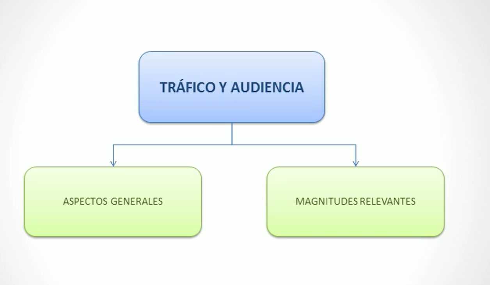
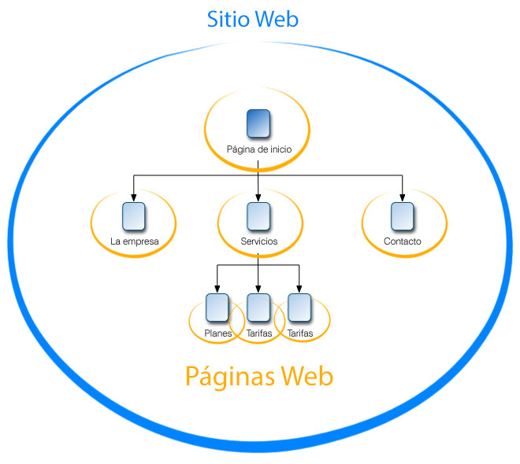
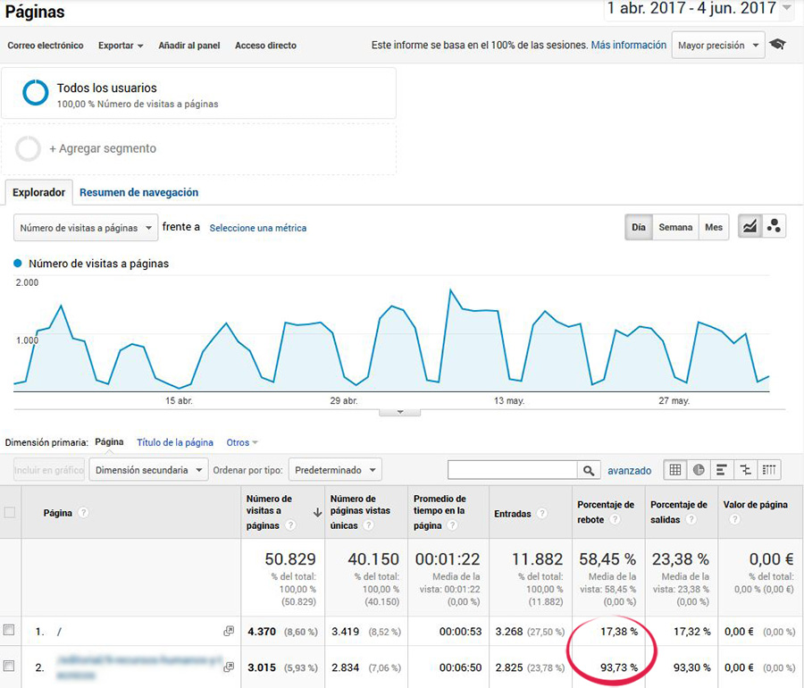
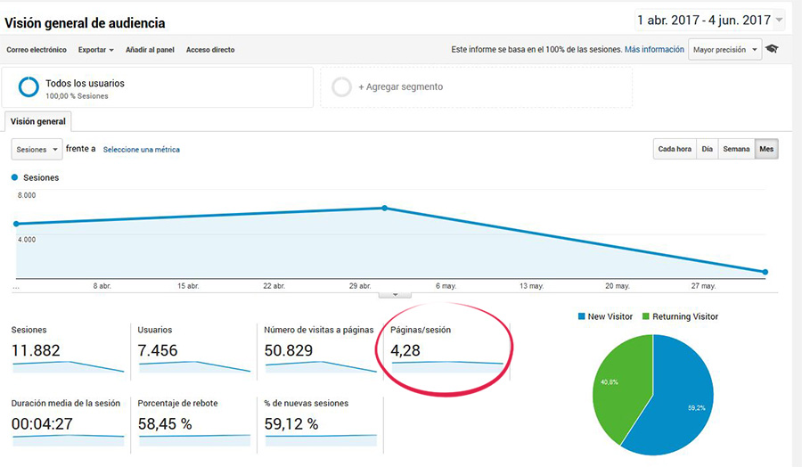
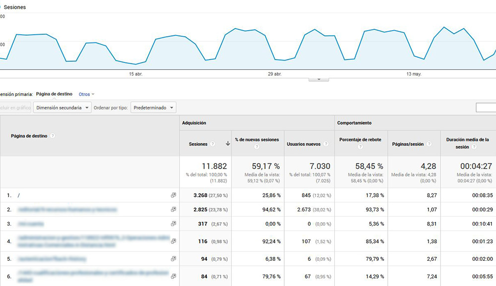
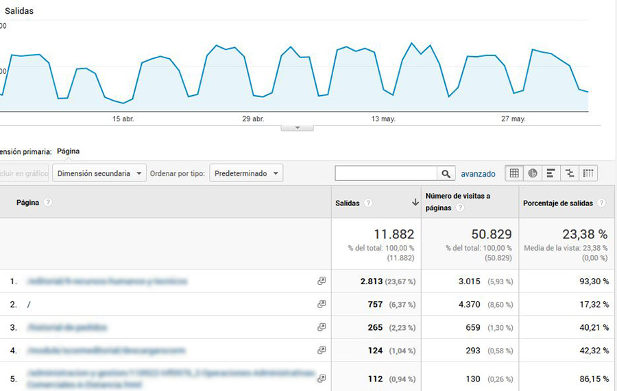

# TRÁFICO Y AUDIENCIA

## Introducción

El tráfico es lo principal en nuestra página web, por lo que, exceptuando ciertos casos, es uno de los objetivos principales a tener en cuenta de cualquier página web, aumentar el tráfico. Por ello es importante conocer si tenemos suficiente tráfico y de no tenerlo, porqué. Por lo tanto debemos definir que KPI's vamos a estudiar y dependiendo tomar acciones para mejorar el flujo de tráfico a nuestro sitio web.

Desde el punto de vista de las métricas analizaremos lo siguiente:

-  Las sesiones
-  Usuarios
-  Nº de visitas a páginas
-  Páginas por sesión
-  Duración media de la sesión
-  % de rebote
-  % de nuevas sesiones
-  Datos demográficos
-  Sistemas operativos
-  Operador desde le que nos visitan

Desde el punto de vista del tipo de tráfico segmentaremos por los siguientes puntos:

-  Orgánico
-  Pago
-  Display
-  Email
-  Directo
-  Referral
-  Social
-  Otros...

Antes de detallar cada uno de los puntos anteriores debemos definir cómo y qué ocurre en el proceso de captación de datos de un visitante.

## Objetivos

-  Conocer las diferencias entre sitio web y página web.
-  Conocer las característias de las Cookies y su función.
-  Conocer las magnitudes relevantes y los tipos de tráficos.

## Mapa Conceptual

## Aspectos Generales

### SITIO Y PÁGINA WEB

Antes que nada estableceremos la diferencia entre **Página y Sitio Web**.

Sitio Web es aquel que esta conformado por un dominio, tomando como ejemplo **www.facebook.com**, todo lo correspondiente a **www.facebook.com** es el sitio web, sus páginas, assets, corporación, etc...

Las **Páginas Web** son cada una de las secciones que conforman un dominio. Usando el ejemplo de **www.facebook.com**, un ejemplo de página ppdria ser **www.facebook.com/perfil-de-prueba**, siendo esta última, una página dentro del sitio **www.facebook.com**.

Es importante saber la diferencia, principalmente por las herramientas que se van a utilizar para poder medir los KPI's, ya que habrán ciertas herramientas que servirán para monitorizar parámetros del sitio web en conjunto o de una página en especifico dependiendo del análisis que estemos realizando y el objetivo marcado.

### COOKIES

Las cookies son datos en formato de texto que el navegador almacena en el ordenador del usuario de manera que permita en un futuro, mediante dicho texto, identificar al usuario y dependiendo del caso, la sesión u cualquier dato que el servidor sea capaz de interpretar y utilizar.

[Descripción medianamente técnica de cómo funciona una cookie]

## MAGNITUDES RELEVANTES

### Introducción

Hay cietos de métricas y tecnicismos relacionados con el mundo de la analítica, tantos que ni la persona más experta en el sector puede conocer en profundidad todas las que puedan existir.

En este curso veremos las métricas mas relevantes que suelen ser comunes en todas las herramientas de análisis disponibles en el mercado.

### Sesiones

Las sesiones son la métrica general más relevante ya que esta contabiliza el total de personas que han visitado nuestro sitio web. Por lo que esta métrica es por definición el **tráfico** que recive nuestro sitio web en un periodo de tiempo definido.

Por otro lado, relacionado pero sin tener un concepto diferente son las **visitas**, las visitas a diferencia de las sesiones son las visitas que reliza un idspositivo en nuestro sitio web a la hora de ir navegando dentro del mismo, por lo que una **sesión** puede tener 10-15-20 **visitas**.

Hay otros conceptos a tener en cuenta a la hora de analizar los datos de una página web como:

-  El termino visitas se refiere a las sesiones que realiza un usuario al momento de entrar a un sitio web y pasa un tiempo navegando dentro de este y se va.

-  Si un usuario permanece activo en nuestra web y permanece inactivo **durante 30 minutos** o más, y luego vuelve a navegar en nuestra web, cuenta como una visita más. Esto es debido a que **las cookies tienen una duración de 30 minutos**, por lo que al estar inactivo por esa cantidad de tiempo, la cookie expira y vuelve a generarse otra.

-  Del mismo modo, si un usuario abandona la web y vuelve antes de los 30 minutos, se considera que esta en la misma visita. Esto se debe tomar en cuenta porque un usuario puede estar navegando en nuestra web durante horas manteniendo una misma visita.

-  El usuario que visita nuestro sitio web y navega dentro de este, sigue contando como una misma sesión independientemente de la cantidad de páginas que haya visitado durante dicha sesión.

-  También podemos ver la cantidad de visitas que ha tenido una página web en concreto. Por lo que la visita al sitio web se cuenta diferente a la visita de una página en concreto. De esta manera podemos ver que productos cuentan con más visitas y cuales con menos para poder tomar acciones al respecto.

-  Hay dos tipos de visitas principales, las **nuevas** y las de **retorno**. Las visitas nuevas son de las personas que es la primera vez que entran en el sitio, por lo que las de retorno son de aquellas que ya han visitado nuestro sitio web con anterioridad.

-  Hemos visto que las cookies tienen caractertisticas temporales que debemos tener en cuenta pero no son las unicas, a continuación veremos otros aspectos que debemos tomar en cuenta respecto a las cookies:

   -  Cuando un usuario accede a un sitio web desde 2 navegadores distintos, se cuenta como visitas diferentes. Esto se debe a que el navegador almacena la cookie en el navegador sin tener la posibilidad de compartir dichas cookies entre navegadores distintos.

   -  Si el usuario borra o no acepta las cookies, no podra ser identificado como el mismo visitante unico en próximas visitas.

-  El registro de las visitas en cualquier herramienta estadística se realiza de la siguinte manera:

   1. Cuando el usuario visita la primera página del sitio, empieza una nueva sesión para el navegador en el cual se encuentre navegando.
   2. Si el usuario en el mismo navegador, vivista distintas páginas dentro de la misma sesión, estas visitas se adjudican a la sesión que se encuentre abierta en ese momento.
   3. La sesión terminara cuando el usuario abandone el sitio o permanezca inactivo por más de 30 minutos.

### Visitantes

Esta métrica es un poco más flexible en cuanto a concepto. Podría definirse como visitantes unicos, visitantes unicos absolutos o visitantes exclusivos. Aunque también ciertas herramientas pueden definir estos como viistantes unicos semanales, mensuales o trimestrales, etc.

Indiepientemente del caso o de como lo gestione la herramienta en cuestión, se refiere al número de usuarios distintos que han accedido a un determinado sitio web en determinado plazo de tiempo. Este número es aproximado por diversos motivos:

-  Cuando dos personas se conectan a una misma página web desde el mismo navegador pero sin cerrar sesión en el navegador, el sistema cuenta la sesión como una sola.
-  Cuando una misma persona accede al sitio desde dos lugares diferentes como por ejemplo, desde el ordenador de casa y luego desde el del trabajo, cuenta como 2 sesiones diferentes cuando realmente se trata de la misma persona.

Cosas a tener en cuenta:

-  Google Analytics inserta una cookie con un identificador unico que caduca a los 2 años desde la creación o actualización. No confundir con la cookie.

-  Si el usuario elimina la cookie manualmente, Google Analytics le asigna una nueva cookie al navegador.

-  Si el navegador usa distintas cuentas de usuario, google asigna una cookie para cada usuario en el navegador correspondiente.

### Promedio de tiempo en un sitio web

Se refiere al tiempo que pasa un usuario visitando nuestra sitio web. A mayor tiempo de visita en nuestro sitio, mayor será la media de retención que tiene nuestro sitio web siendo este un signo positivo para nuestro sitio o marca.

Las distintas herramientas de recopilación de datos obtienen esta medida de distintas maneras, para usar como referencia siendo Google Analytics la herramienta principal para esta tarea, GA lo que hace es empezar a contar desde que se realiza el primer (HIT) o acción dentro de la página. Sin esta acción NO EMPIEZA EL CONTADOR.

Por lo que dependiendo el caso Google puede o no contabilizar el tiempo de sesió dentro de nuestro sitio:

1. Sin interacción: Esto ocurre cuando el usuario entra a una página web en la cual no interacciona EJ: una landing page; y luego se marcha del sitio. En este caso el contador no se toma en cuanta porque Google no cuenta dicha interacción como sesión.

2. Interacción con cambio de página: Un usuario accede a una página de un producto de nuestro catálogo, pasado unos minutos este decide cambiar el color del teléfono y esto ocaciona una recarga en la página del teléfono para mostrar la correspondiente al color rojo. Este tiempo que ha transcurrido desde que el usuario accedio a la página y cambio a la página con el atributo del teléfono en otro color SI CUENTA debido a que el cambio se ha realizado saliendo de una página de nuestro dominio para entrar a otra que sigue dentro de nuestro dominio.

3. Interacción pero sin cambio de página: Imaginemos ahora que el usuario al entrar a la página y ver el producto decide añadirlo al carrito de compra ocasionando un click en el boton de "añadir al carrito" y por ende disparando el (HIT). En este ejemplo en concreto tenemos que tomar en cuenta lo siguiente: Supongamos que el usuario entro a la página a las 9.00, recargamos la página a las 9.05 y tocamos el botón a las 9.10; luego terminamos la compra a las 9.15, pero no hemos recargado la página ni hecho click en ningún otro click que hayamos programado. El tiempo registrado sería de 10 minutos desde que entramos a la página e hicimos click en el botón de añadir el carrito. Los 5 minutos restantes hasta el final del proceso de compra no se toman en cuenta.

### Tasa o % de Rebote

Esta tasa de rebote se ocaciona cuando los usuarios entran a la página web sin realizar ningún hit o activar ningín (HIT).

La tasa de rebote se refiere que si por ejemplo entran a nuestra página 100 usuarios pero solo 30 navegan o activan hits dentro de nuestra página, esto quiere decir que tenemos una tasa de rebote del 70%.

Hay una pregunta que puede surgir debido a todo esto: **¿Cuánto es una tasa de rebote normal?**

Para responder a la anterior pregunta hay que tomar en cuenta la naturaleza de nuestro sitio web. En los siguientes ejemplos entraremos más en detalle al respecto.

1. Ecommerce de venta de ordenadores portatiles con una tasa de rebote del 80% con muchos elementos clicables y un tiempo medio de visita de 20 segundos.

2. Blog de informatica en el que se muestran y se responden dudas y preguntas de los lectores con una tasa de rebote del 80% en el cual solo hay una barra de navegación para navegar entre articulos y secciones con un tiempo medio de visita de 4 minutos.

A priori ambos necesitan realizar cambios pero en el caso del primer ejemplo parece que algo esta fallando.

Observando los datos del primer ejemplo, al ser una visita en la cual la gente tiene que tomarse un tiempo para estudiar y analizar los datos que le muestran de los equipos o de los productos disponibles. Estamos fallando debido a que los clientes no se encuentran retenidos la cantidad de tiempo necesaria.

En el caso 2, podemos observar que es más complicado de hacer click en los HITs por lo cual el hecho de que este contando los hits, indica que los usuarios estan navegando dentro de nuestro sitio y el tiempo de visita nos dice que la gente esta interesada en la información que se les esta presentando. Para mejorar la estadística, podriamos por ejemplo, al final de cada post, incluir alguna acción que active un hit de manera que podamos mejorar nuestra tasa de rebote.

### Páginas por sesión

Está métrica se basa en sacar una media de la cantidad de páginas que los usuarios visitan por cada sesión.

Está métrica también se debe interpretar correctamente dependiendo de la naturaleza del sitio en cuestión.

### % de nuevas sesiones

Está métrica define a los ususarios que entran a nuestro sitio web por primera vez o aquellos que han borrado la cookie de su navegador, entran desde otro navegador o dispositivo, etc... contando estos como nuevas sesiones.

Esta es una métrica interesante porque nos permite saber cuantos usuarios tenemos fidelizados y, por ejemplo, al realizar una campaña, podemos observar que tan efectiva ha sido atrayendo a nuevos usuarios.

Si es una web muy especializada con un nicho de mercado muy reducido, es normal que está métrica sea baja ya que los usuarios son personas que suelen volver al no tener muchas opciones o al ser un publico muy de nicho.

En otro caso, supngamos que tenemos un E-commerce de venta de coches de segunda mano. En este caso la tasa de nuevas sesiones deberia ser elevada al ser estas visitas más de carácter general y los clientes son más esporadicos. En este tipo de webs si hay una relación entra la cantidad la cantidad de nuevos usuarios y el aumento en las ventas de la plataforma.

### Páginas

Son todas las secciones/páginas que visita un usuario. Podremos difereciar entre páginas de entrada, en las que los usuarios acceden a nuestra web; y las de salida, siendo estas las que los usuarios usan para salir de nuestra web.

Esta métrica suele ser más elevada que el conteo de usuarios, esto se debe a que un usuario en una sesión puede visitar una o más páginas en dicha sesión.

Este dato se suele utilizar en conjunto con otros datos para poder tener una mejor visión acerca de lo que este aconteciendo en nuestra web.

El objetivo principal y más utilizado se suele usar para analizar los datos de una página en concreto. Si es verdad que el dato del sitio en conjunto puede darnos información relativa al comportamiento del usuario, a menos que analizemos página por página, no podremos identificar cuales son las páginas que estan recibiendo más visitas y cuales menos y por ende tomar acciones para mejorar esos datos. Como en el caso de que una sola página este generando el 60% de la facturación del sitio, a menos que analizemos dicha página y constatemos sus datos con las demás no podremos tener un espectro el cual nos indique que es lo que esta ocurriendo con esa página para que este generando tantas visitas en relación con el resto de páginas del sitio.

#### Páginas de entrada

Al analizar las páginas de manera individual hay que tomar en cuenta el tipo de tráfico que esta está generando y el tipo de tráfico que genera la misma. Según **Gema Muñoz**, esto son los aspectos que debemos tomar en cuenta a la hora de analizar una página en concreto:

> Aquellos que ven la página y se van: De nada nos sirve atraer usuarios a una página si estos al entrar no encuentran motivos para quedarse o para continuar navegando dentor de la misma.
> _Se recomienda analizar la tasa de rebote_

> Aquellos usuarios que ven la página y continuan navegando dentro de la misma: Debemos tener en cuenta si el tráfico interesado es de calidad o no.
> _Se recomienda estudiar las páginas vistas por visita y la duración media de la visita_

> Usuarios que llegan a la página, continuan navegando en nuestro sitio y llegan a convertir.
> _Se debe analizar la tasa de rebote como la tasa de conversión de las páginas de entrada._ Dependiendo el caso podemos encontrarnos con los siguientes escenarios:
>
> > Tasa de conversió alta y tasa de rebote alta: En este caso debemos analizar y corregir con urgencia según sea el caso.
>
> > Tasa de conversión baja y tasa de rebote alta: En este caso hay algún problema en la conversión del usuario, por lo que se debe estudiar que es lo que esta haciendo que el usuario abandone le proceso antes de llegar a convertir.
>
> > Tasa de conversión muy baja (casi cero) y tasa de rebote muy alta: En este caso es una página fallida, se recomienda eliminar directamente.

#### Páginas de salida

En el caso de las páginas de salida debemos tomar en cuenta cuales de ellas se trata para tomar decisiones de manera correcta.

Dos de las más importantes son la Home o cualquier página que contenga productos, que en definitiva es lo que nos interesa optimizar.

-  Home: En este caso es normal que la tasa de salida sea alta por lo que debemos analizar es la tasa de rebote. Si la tasa de rebote es baja y una tasa de salida alta, indica que los usuarios entra a nuestra página, navegan por nuestro sitio y luego salen por la misma página de Home. Si la tasa de salida es alta al igual que la tasa de rebote, tenemos un problema porque indica que los usuarios al entrar a la web, algo los incita a salir sin navegar.

-  Páginas en las que se puede realizar una compra: La última página del proceso de compra (típica página de "Gracias por su compra | vuelva pronto | thanks for your money 💸"), debe ser esta, dentro del flujo del proceso de compra (carrito - formulario de datos del comprador - pago - página de verificación de compra | "grácias por su compra"). Si en alguno de los pasos anteriores a dicha página tiene una tasa inusualmente alta de salida, debemos estudiar que esta pasando para que los usuarios abandonen el proceso de compra.

