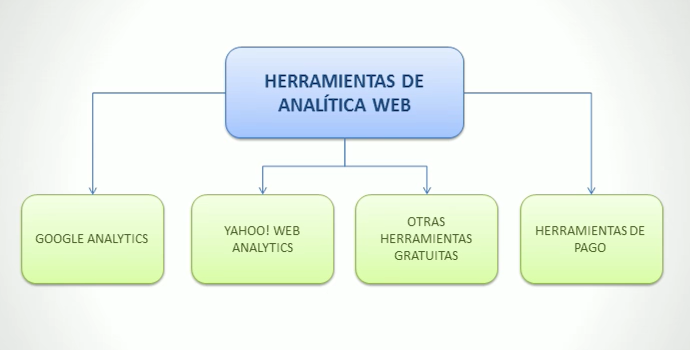
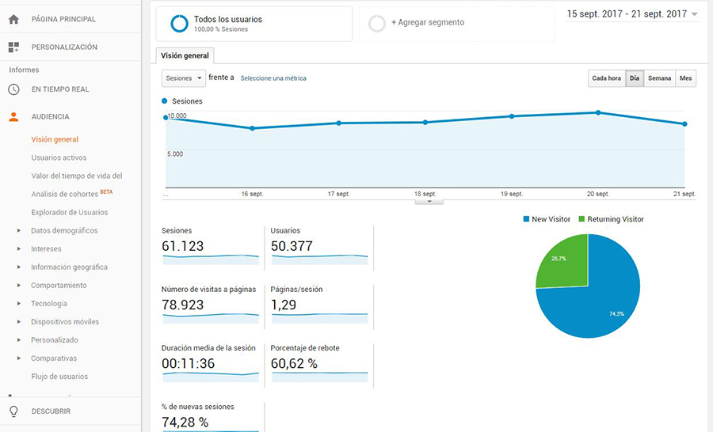
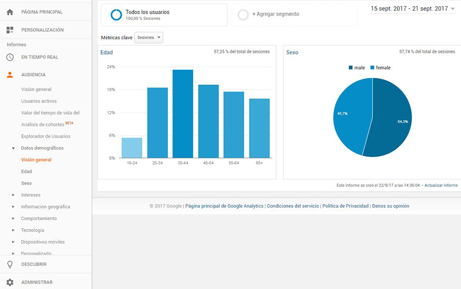
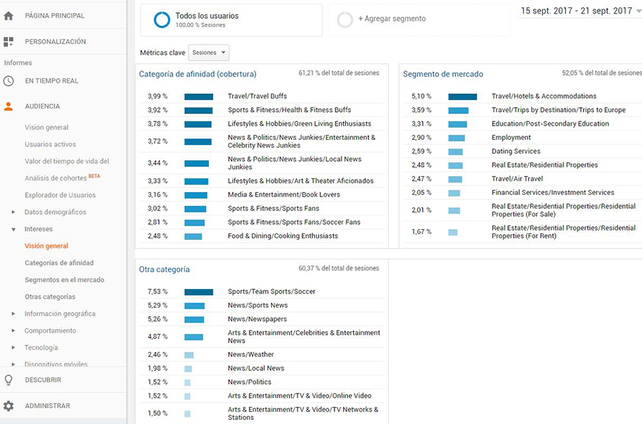
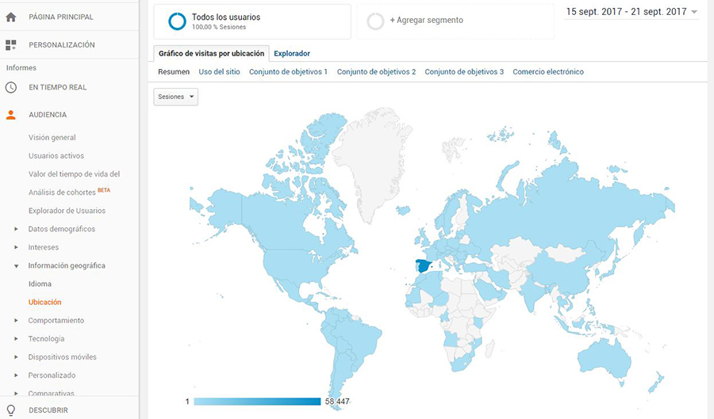
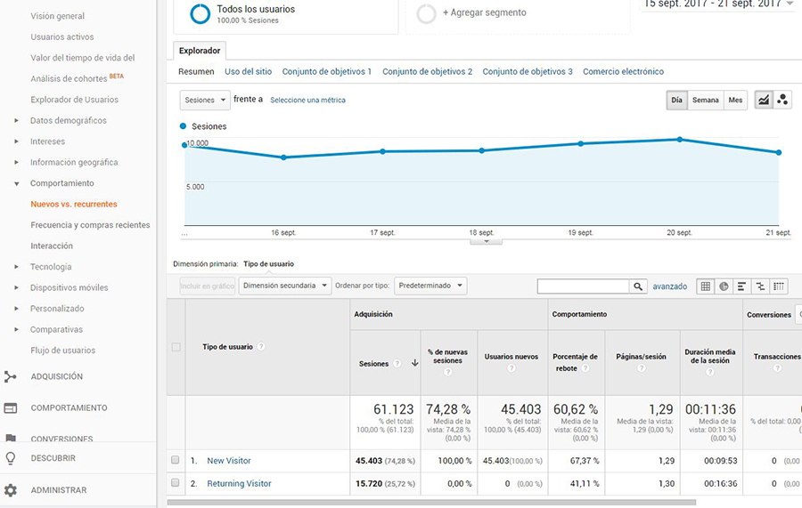
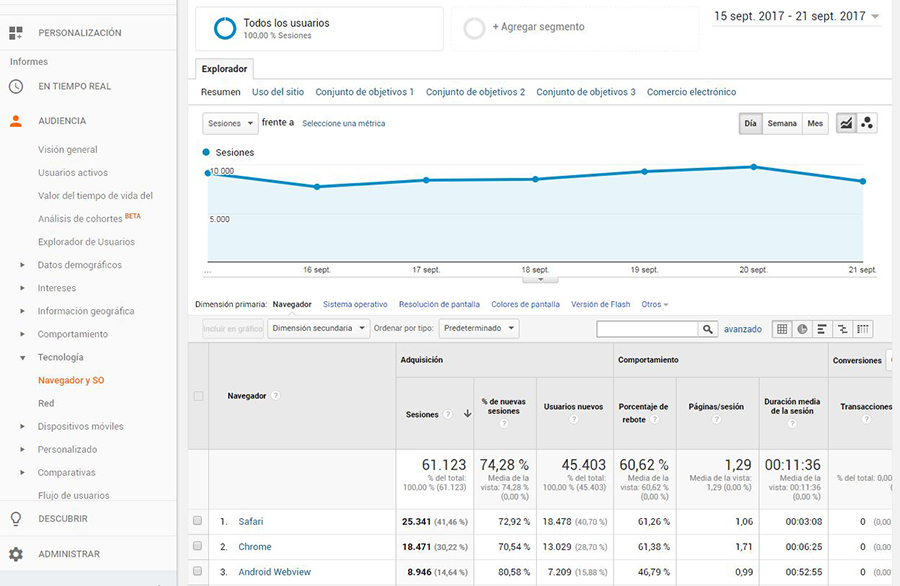
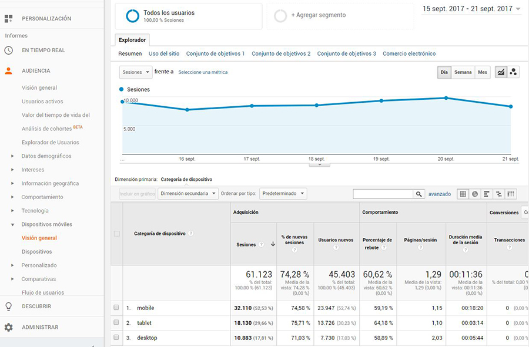

# HERRAMIENTAS DE ANALÍTICA

En este apartado profundizaremos en el uso de:

- El uso de Google analytics y el uso de yahoo analytics.
- Conocer herramientas gratuitas de analítica web.
- Conocer herramientas de pago de analítica web.

## Mapa conceptual

## Google Analytics

### ¿Qué es Google Analytics?

Analytics, desde ahora GA como se suele conocer por su acrónimo, es la herramienta que nos proporciona Google para poder analizar la audiencia, tráfico, comportamiento conversiones, entre otras métricas.

Esta herramienta funciona usando en conjunto cookies de navegador, las distintas API's del navegador y fragmentos de código Javascript para poder trabajar correctamente.

### Crear cuenta y configurar Google Analytics

Para poder configurar correctamente GA tenemos que hacer lo siguiente:

1. Crear una cuenta de GA en https://www.google.com/analytics e iniciar sesión.
2. Crear una nueva propiedad y configurar el entorno para poder analizar las métricas web de nuestro sitio. ** Este proceso suele ser bastante intuitivo.
3. Realizado los pasos anteriores, GA nos provee un ID para dicha propiedad y un fragmento JS que tendrémos que incluir en todas las páginas de nuestro sitio web.

### Incorporar código de seguimiento

Resumiendo el tutorial podriamos decir que tenemos que encontrar en las pestañas de configuración de la propiedad el código de seguimiento js que utilizaremos para darle seguimiento a nuestro sitio web.

Después de haber configurado correctamente el código JS en nuestro sitio web, comprobamos en el dashboard de GA que esta recopilando correctamente los datos.

### Cambiar configuración de cuenta de GA

** Información redundante acerca de la configuración de la propiedad a analizar.

### Gestión de usuarios

También podemos agregar o eliminar usuarios a la propiedad para que puedan utilizar y analizar los datos de nuestro sitio web. Podemos indicar que tipo de usuario queremos agragar y sus permisos.

### Funcionalidades básicas de GA

Uno de las principales funcionalidades de GA es poder analizar los datos usando la fecha como filtro. Esto nos permite tener análisis más precisos dependiendo de la temporalidad del estudio en cuestión.

En conjunto con las variables explicadas anteriormente, usamos estas en conjunto con la que veremos a continuació para tener un análisis más profundo respecto a los puntos que estemos estudiando.

#### Audiencia

Este punto se refiere al como identificamos al perfil del tráfico que nos visita. Las herramientas nos permiten obtener además de los datos geográficos, otros datos de interes para poder segmentar correctamente los datos de los visitantes.

- Visión General:

    En esta vista podemos ver de un vistazo los puntos más importantes que nos proporciona la herramienta para poder analizar rápidamente los datos de nuestro sitio web.

- Datos demográficos:

    Perfíl ordenado por edad y sexo de nuestros visitantes. **Esta información debemos activarla manualmente** mediante la configuración de la propiedad en el panel de administración de Google Analitycs.

- Interes:

    Al crear una propiedad en GA, debemos indicar el sector al cual pertenece nuestro sitio web. Esta configuración es importante porque nos ayuda mediante sus herramientas internas a saber los intereses de los visitantes. Esta métrica es bastante importante porque nos ayuda a saber en que sitios debemos enfocarnos para mejorar nuestras campañas de marketing y negociación con sitios de terceros.

- Información Geográfica:

    Esta métrica nos indica la ubicación y el idioma de los visitantes. Muy interesante para webs que tienen un enfoque internacional. Esto nos ayuda a saber e que idiomas debemos priorizar la traducción y mejorar nuestras campañas de marketing dependiendo de la ubicación de neustros visitantes.

- Comportamiento:

    Se trata de información que devuelve referente al comportamiento de las sesiones. Podremos ver los visitantes nuevos y los recurrentes, la frecuencia media de los usuarios (dependiendo del intervalo de tiempo el cual se este estudiando).

    

- Tecnología:

    Datos sobre le navegador y la compañia telefónica del cual estan usando la red.

- Dispositivos móviles:

    Métricas detalladas sobre el formato del dispositivo utilizado en la visita (Móviles, tabletas o pc), incluso podemos saber le modelo exacto de los mismos.

