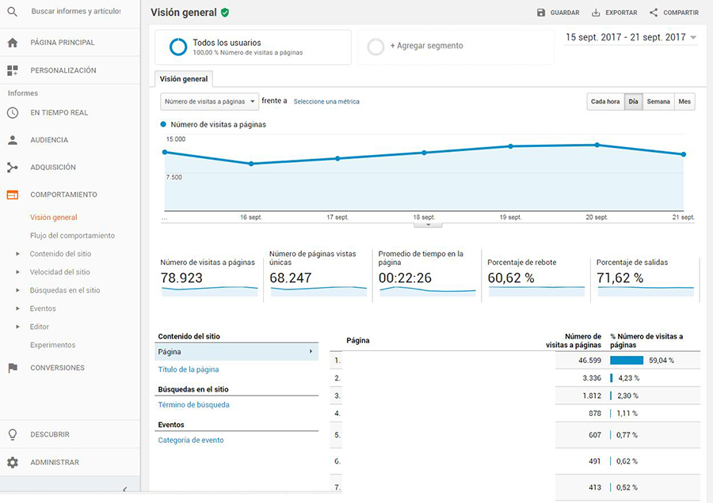
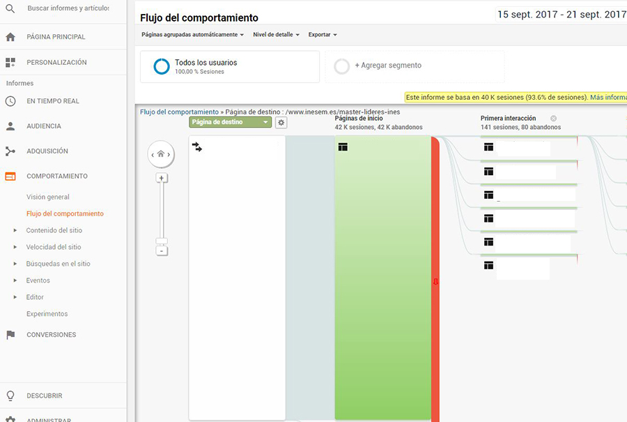
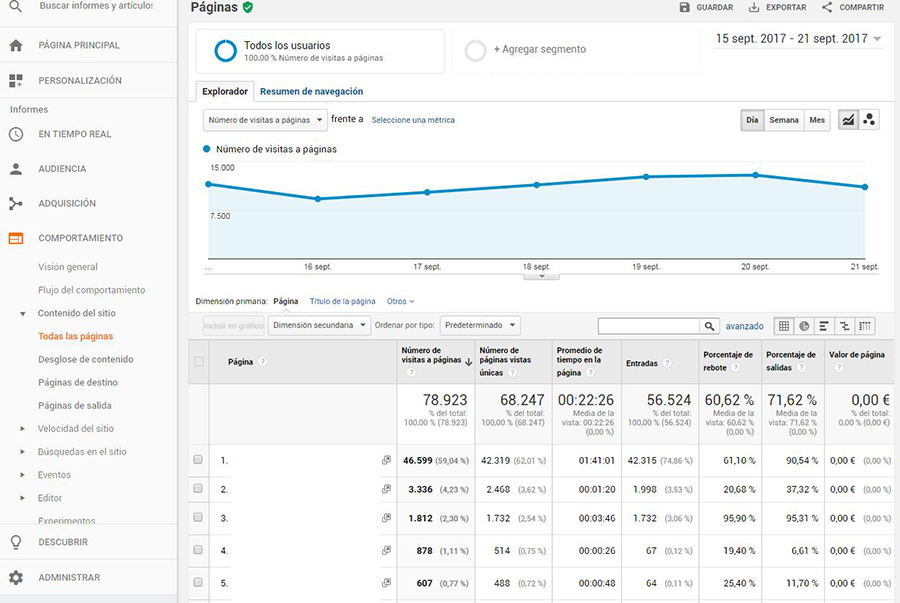
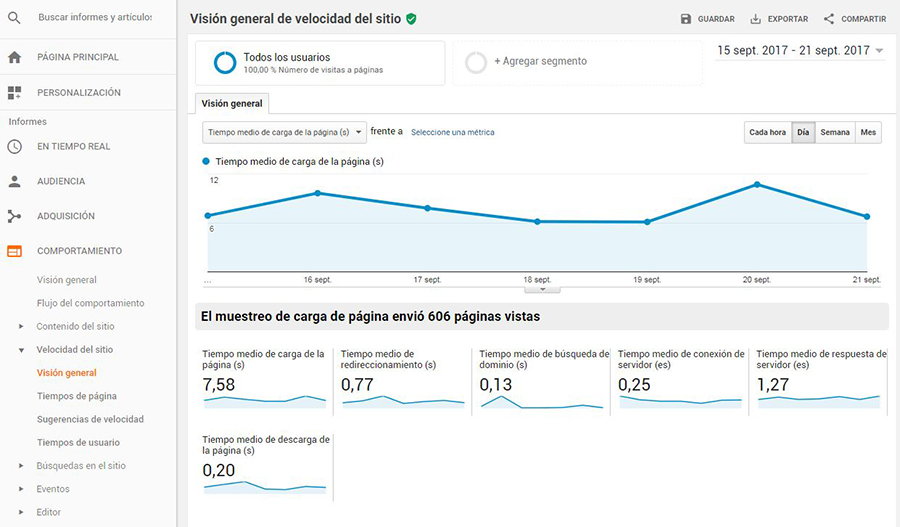
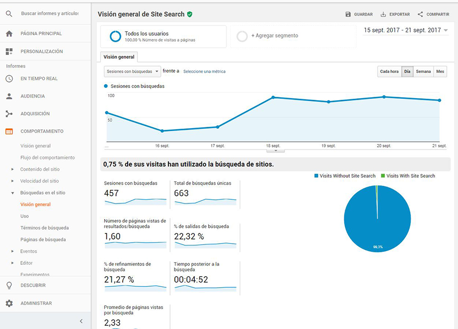

# HERRAMIENTAS DE ANALÍTICA

En este apartado profundizaremos en el uso de:

- El uso de Google analytics y el uso de yahoo analytics.
- Conocer herramientas gratuitas de analítica web.
- Conocer herramientas de pago de analítica web.

## Mapa conceptual

## Google Analytics

### ¿Qué es Google Analytics?

Analytics, desde ahora GA como se suele conocer por su acrónimo, es la herramienta que nos proporciona Google para poder analizar la audiencia, tráfico, comportamiento conversiones, entre otras métricas.

Esta herramienta funciona usando en conjunto cookies de navegador, las distintas API's del navegador y fragmentos de código Javascript para poder trabajar correctamente.

### Crear cuenta y configurar Google Analytics

Para poder configurar correctamente GA tenemos que hacer lo siguiente:

1. Crear una cuenta de GA en https://www.google.com/analytics e iniciar sesión.
2. Crear una nueva propiedad y configurar el entorno para poder analizar las métricas web de nuestro sitio. ** Este proceso suele ser bastante intuitivo.
3. Realizado los pasos anteriores, GA nos provee un ID para dicha propiedad y un fragmento JS que tendrémos que incluir en todas las páginas de nuestro sitio web.

### Incorporar código de seguimiento

Resumiendo el tutorial podriamos decir que tenemos que encontrar en las pestañas de configuración de la propiedad el código de seguimiento js que utilizaremos para darle seguimiento a nuestro sitio web.

Después de haber configurado correctamente el código JS en nuestro sitio web, comprobamos en el dashboard de GA que esta recopilando correctamente los datos.

### Cambiar configuración de cuenta de GA

** Información redundante acerca de la configuración de la propiedad a analizar.

### Gestión de usuarios

También podemos agregar o eliminar usuarios a la propiedad para que puedan utilizar y analizar los datos de nuestro sitio web. Podemos indicar que tipo de usuario queremos agragar y sus permisos.

### Funcionalidades básicas de GA

Uno de las principales funcionalidades de GA es poder analizar los datos usando la fecha como filtro. Esto nos permite tener análisis más precisos dependiendo de la temporalidad del estudio en cuestión.

En conjunto con las variables explicadas anteriormente, usamos estas en conjunto con la que veremos a continuació para tener un análisis más profundo respecto a los puntos que estemos estudiando.

#### Audiencia

Este punto se refiere al como identificamos al perfil del tráfico que nos visita. Las herramientas nos permiten obtener además de los datos geográficos, otros datos de interes para poder segmentar correctamente los datos de los visitantes.

- Visión General:

    En esta vista podemos ver de un vistazo los puntos más importantes que nos proporciona la herramienta para poder analizar rápidamente los datos de nuestro sitio web.

- Datos demográficos:

    Perfíl ordenado por edad y sexo de nuestros visitantes. **Esta información debemos activarla manualmente** mediante la configuración de la propiedad en el panel de administración de Google Analitycs.

- Interes:

    Al crear una propiedad en GA, debemos indicar el sector al cual pertenece nuestro sitio web. Esta configuración es importante porque nos ayuda mediante sus herramientas internas a saber los intereses de los visitantes. Esta métrica es bastante importante porque nos ayuda a saber en que sitios debemos enfocarnos para mejorar nuestras campañas de marketing y negociación con sitios de terceros.

- Información Geográfica:

    Esta métrica nos indica la ubicación y el idioma de los visitantes. Muy interesante para webs que tienen un enfoque internacional. Esto nos ayuda a saber e que idiomas debemos priorizar la traducción y mejorar nuestras campañas de marketing dependiendo de la ubicación de neustros visitantes.

- Comportamiento:

    Se trata de información que devuelve referente al comportamiento de las sesiones. Podremos ver los visitantes nuevos y los recurrentes, la frecuencia media de los usuarios (dependiendo del intervalo de tiempo el cual se este estudiando).

    

- Tecnología:

    Datos sobre le navegador y la compañia telefónica del cual estan usando la red.

- Dispositivos móviles:

    Métricas detalladas sobre el formato del dispositivo utilizado en la visita (Móviles, tabletas o pc), incluso podemos saber le modelo exacto de los mismos.

#### Adquisición:

- Visión general:

    En esta sección veremos una visión general de los principales medidores que nos provee esta herramienta.

- Todo el tráfico:

    Se trata de un análisis más especifico de cada sección. En este apartado podremos  ver la Fuente/Medio la cual es el encargado de mostrar la información relativa a las campañas publicitarias de marketing.

- Adwords: 

En esta podremos ver un vistazo general de las campañas de Adwords que tengamos activas junto al departamento de Marketing. En este podremos observar de manera ráìda las pujas, las palabras claves, el tráfico, y las url's finales.

- Search Console: 

En este apartado podremos ver un resumen de las estadísticas más relacionadas con el seo de nuestros sitios web. Aunque nos muestra un breve resumen, lo mejor es ir directamente a la herramienta de Search Console para poder analizar mejor estos datos por separado. Esto lo podremos hacer en https://www.google.com/webmasters

- Medios Sociales: 

Tráfico proveniente de distintas redes sociales.

- Campañas: 

Este es el encargado de mostrar tanto las campañas de Adwords como las campañas que traen tráfico de webs externas. Aquí podremos monitorizar las camapañas personalizadas que comentamos anteriormente que usan los parámetros UTM_*.

#### Comportamiento:

- Visión General: 

Este nos permite ver una visión general de los datos de comportamiento de nuestro sitio web pero más enfocado a los datos provenientes de las páginas.

- Flujo de comportamiento: 

Se trata de un esquema gráfico que nos permite ver el flujo de páginas por las cuales los usuarios visitan a lo largo de su sesión por nuestro sitio web.

- Contenido del sitio: 

Información relativa a todas las páginas del dominio. Nos permite ver de un vistazo informació de todas las páginas y sus datos para observer cuales estan aumentando o reduciendo sus visitas a lo largo del tiempo.

- Velocidad del sitio:

Mediante esta sección podremos ver los tiempos de carga de nuestro sitio web y cada una de sus páginas para poder optimizar el rendimiento de las mismas.

- Busquedas en el sitio:

Mediante esta sección podremos observar mediante el buscador interno del sitio, cuales son las busquedas que los usurios suelen realizar y poder estudiar cuales son los productos o servicios de mayor interes para nuestros usuarios.

#### Conversiones:

- Objetivos:

En este apartado debemos haber previamente definido los objetivos que deseamos que nuestro sitio web satisfaga mediante el panel de administración del dominio en GA.

- Comercio Electrónico:

Al igual que el paso anterior, debemos definir los objetivos manualmente en el panel. Estas están más enfocadas a las conversiones de tipo comercio electronico teniendo apartados especificos para definir y capturar las conversiones de estos.

- Embudos multicanal:

Los embudos estan diseñados para poder guiar a los usuarios al lugar donde se producirá la conversión en cuestión. Esto nos permite analizar en que parte del embudo los usuarios abandonan el proceso de conversión.

---

Hay muchos más conceptos que abarcar de GA pero estos no se van a tocar debido a que se requiere de un nivel más avanzado de conocimientos para poder sacarle todo el provecho a dicha información.

