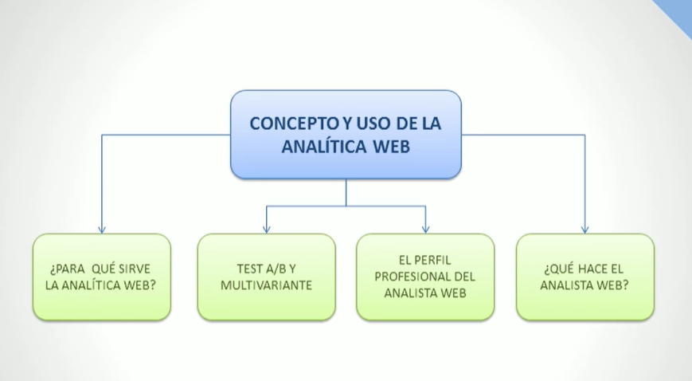

# CONCEPTO Y USO DE LA ANALÍTICA WEB

## Introduccion

En terminos simples se basa en la recopilación, análisis y evaluacián de los datos que recoge nuestra página web.
Podemos desglozarlas en dos categorias principales:

1. Análisis de carácter general: Es el análisis más generalizado que podemos hacer de una página web como podria ser la cantidad de visitas, la duración de las mismas o que páginas ha visitado antes de irse el usuario.
2. Análisis de carácter especifico: Este se basa más en analizar una acción en concreto que deseemos parametrizar, por ejemplo, campañas de SEO/SEM, páginas visitadas concretas, % de personas que provienen de una campaña publicitaria, dispositivo que ha realizado la visita, botones pulsados, zonas calientes de la página etc...

Siempre se debe establecer objetivos realistas y medibles que nos puedan servir de referencia para saber el impacto de la campaña que estemos parametrizando.

Tambien hay que tomar en cuenta que comportamientos tiene el consumidor.

## Objetivos

1. Conocer las características y funciones de la Analítica Web.
2. Reconocer qué impacto pueden tener las páginas web en usuarios y buscadores.
3. Conocer el perfil del analísta Web y sus funciones.

## Mapa conceptual

### ¿Para qué sirve la analítica web?

1. Saber que dicen de ti.

Las redes sociales nos pueden ayudar en gran medida para saber cual es la opinión de las personas acerca de nuestro producto o servicio, podemos estudiar el comportamiento de los usuarios en redes sociales y realizar acciones en consecuencia de manera que podamos mejorar la percepción de los clientes acerca de nuestro producto o servicio.

Hay que estudiar y analizar dichas interacciones ya que el dinamismo que ofrece internet, puede hacer que en muy poco tiempo la imágen y la percepción de los clientes a nuestra marca, producto o servicio se vea perjudicada. Por este motivo es muy importante poder contar con buenas herramientas de medición.

2. ¿Qué productos de nuestra web son realmente interesantes?

Podemos tener un control de qué productos son los que más se estan vendiendo de manera que podamos tomar acciones para aumentar la visibilidad o poder mejorar las campañas de marketing de los productos que no se esten vendiendo.

3. Conocer el origen de nuestros compradores.

Una de las ventajas de internet es que se ha encargado de eliminar barreras entre paises. Esto nos permite saber que productos o servicios estan teniendo mayor inpacto según qué regiones o paises y poder tomar acciones en consecuencia. Podemos analizar en mayor detalle los comportamientos y los gustos segmentando nuestros clientes por su origen y/o cultura para poder ofrecerles un producto o servicio de mejor calidad adaptado a ellos.

4. ¿Quíen me busca y por dónde?

A traves de ciertas herramientas podemos saber el perfil de los clientes que nos suelen buscar. Esto nos permite poder ofrecer un producto o servicio de mejor calidad para estos estudiandos su sexo, edades, intereses etc...

Respecto a el "donde" nos referimos a mediante que vía nos encuentran nuestros clientes, siendo Google el principal puente entre los usuarios que nos visitan y nuestra página. Aunque no se limita a google, hay otros buscadores como podrian ser Bing o Yahoo que tienen su propio nicho de mercado y algoritmos y formas de trabajar diferentes a como se podría trabajar con Google.

5. ¿Qué páginas interesan y cuales no?

Este punto se refiere a dentro de nuestras páginas webs, dependiendo el caso, poder analizar cuales son las páginas que estan teniendo mayor o menor tráfico y dependiendo el caso poder actuar en consecuencia.

6. ¿Es mi página la que realmente quieren mis usuarios?

Las herramientas de analítica web arrojan datos constantemente pero debemos aprender a interpretarlos de manera correcta. En este punto se refieren al como saber si una página web está teniendo el impacto que deseamos que tenga y de buscar maneras de estudiar si es un impacto positivo o negativo.

Además de establecer objetivos, debemos tener tests A/B de manera que estos nos permitan saber si los usuarios prefieren un modelo u otro a la hora de interactuar con nuestra página web.

## Test A/B y Multivariante

Según la naturaleza de nuestra página web, podriamos usar 2 tipos de test para medir su eficacia e impacto:

1. Test A/B:

Este tipo de test se realiza haciendo cambios en la estructura de la página web y el contenido de la misma de manera que hayan 2 versiones de nuestra página trabajando en simultaneo, esto nos permitirá saber cual de las dos cumple o mejora los parámetros que estemos estudiando a la hora de hacer los cambios.

2. Test Multivariante:

Este tipo de test se utiliza cuando queremos hacer cambios en un elemento concreto de nuestra página web sin modificar el contenido general ni la estructura de la misma. A diferencia del test A/B se recomienda hacerlo cuando tenemos mucho tráfico en nuestra web, no se pueden hacer cambios muy bruscos ya que esto nos puede perjudicar gravemente a la hora de retener a los clientes que ya estan habituados a interactuar con nuestra página web.

## Perfil profesional de analista web.

Se trata de un perfil profesional que no lleva muchos años entre las empresas. Es un perfil que lleva mucho tiempo en Auge debido a que llego al llegar el entorno digital a formar parte de nuestras vidas.

Esta clase de profesional debe estar capacitado para pode extraer, explroar, asociar y analizar los datos de la web. Para esta clase de puestos serán para aquellas personas que faciliten el razonamiento lógico y que trabajen con un gran volúmen de datos como la mineria de datos, inteligencia de negocio, inteligencia de clientes, capacidades de síntesis y olfato empresarial.

También sera preciso el conocimiento de disciplinas complementarias como podrian ser el posicionamiento web, la usabilidad, copywriting y el conocimiento básico de la web (Protocolos, cookies, formularios, sesiones, estructura de contenidos).

A su vez, se ocupa de interpretar los resultados, elaborar informes y tener conocimientos del contexto en el cual se lleva a cabo la analítica web.

Por otra parte no se debe confundir entre las aptitudes analíticas y el manejo de herramientas de analítica web. El uso de las herramientas de analítica web suele ser intuitivo, pero el saber utilizar las herramientas no es garantía de tener capacidades de análisis. Además del uso de estas herramientas debe complementarse con el uso de herramientas como hojas de calculo, entornos de minerias de datos o analítica predictiva.

Hay que tener en claro que el analista web no es un programador informático, de hecho, este tipo de aptitudes se considera incompatibles con el desempeño de sus tareas primordiales.

## ¿Qué hace el analista web?

Se trata de un perfil reciente en el mercado laboral que permite resumir y analizar el funcionamiento de una página web en la que en los casos de e-commerce, se trata del núcleo principal de su actividad.

Se podria indentificar como director de flujos informacionales, situado en medio de los equipos de gestores de información y los datos que genera el domino web diariamente. Es una persona que debe poner en marcha una etodología de trabajo sólida que permita resumir información para que los tomadores de decisiones puedan tomar dichas decisiones utilizando los datos previamente analizados, de manera gráfica y sencilla.

Como se puede observar su posicion es crítica. Tiene en su capacidad aprobar o desechar decisiones en base a sus resultados, por lo que debe ser meticuloso a la hora de realizar los análisis para hacerlo de manera correcta. Los principales pasos a seguir para hacerlo son:

### 1. Establecer objetivos claros.

Como se especifico anteriormente, a la hora de definir objetivos claros y consisos determinará el progreso y avance de nuestro análisis. Por ello debemos diferenciar entre macro y micro objetivos.

Los macro objetivos pueden ser: aumentar los ingresos, aumentar las solicitudes de información (leads), disminuir los costes de gestión, generación de Branding, entre otros.

Una vez definidos los macro objetivos es hora de afinar un poco más. Usando como ejemplo un E-commerce, a la hora de realizar una compra o venta, dependiendo del punto de vista como consumidor o empresario, hay varias acciones antes de finalizar el proceso. Estas acciones son las que utilizaremos en las métricas (KPI's) que podrian ser por ejemplo, aumentar el volumen total de los productos que se añaden a los carritos, disminuir la cantidad de personas que abandonan el proceso de compra, aumentar el trafico para un producto/servicio que deseemos vender, etc...

Un ejemplo de macro objetivo podría ser **gestionar la reputación online de la marca.**

Imaginando el caso de que entremos en una crísis de reputación, sabiendo que internet, el uso de redes sociales y el aumento en consumo de dichos medios por parte de los consumidores; pueden ocacionar que en algún momento por algún motivo se generen comentarios negativos hacia nuestra marca y por ende, debemos tener buenas herramientas de monitorización para poder recopilar dichos comentarios, analizarlos y tomar acciones en consecuencia. Si no realizamos ninguna acción, esto puede afectar aún más de manera negativa a nuestra percepción de marca hacia nuestros usuarios.

### 2. Contextualizar el proyecto

La característica principal de un prodigioso analísta web es la capacidad de analizar todas las posibles variables que intervienen en un proyecto. Es necesario que tenga en cuenta todas las acciones que haga la empresa y el mercado en el que opera, así como su logística, proveedores, capital humano, etc...

Imaginemos el caso de una empresa que vende uniformes escolares online. Las temporadas de mayor volumen de ventas van a ser a los inicios de clases en los mese de septiembre de cada año. En este més habrá un pico de tráfico por lo que si no interpretamos este dato de manera correcta, podemos presentar analisis equivocos y se tomarán decisiones equivocadas. Lo mismo si por ejemplo el equipo de marketing decide realizar una campaña en la cual no estamos informados, veremos un pico de tráfico sin tener claro el porqué el incentivo de las visitas y/o ventas.

### 3. Elegir una buena herramienta de análisis.

Las herramientas web junto a los softwares de tratamientos de datos serán el día a día de nuestro trabajo. Las herramientas web nos permite extraer los datos recopilados de la interacción de los usuarios con nuestra página web y el uso de los softwares de analisis de datos nos permiten relacionar, analizar y mostrar de manera gráfica los datos recopiladores para poder darles sentido y elaborar informes para poder tomar decisiones.

Podemos ver desde dónde vinieron, número de páginas visitadas, buscadores, palabras clave utilizadas en la busqueda, contenido visitado, duración de la visita, número de veces que alcanzan los objetivos, funcionamiento de las campañas, geolocalización de los visitantes, si es su primera vista, etc.. Ademas podremos identificar el comportamiento del usuario desde que ingresa a nuestra página web hasta que se marcha. Permitiendonos optimizar el disño, el contenido y maximizar el rendimiento de nuestra página web.

Por otro lado tenemos herramientas que nos permiten comprar una página web con otra, pudiendo analizar las posibles debilidades y subsanarlas, incluyendo el SEO de las mismas.

La herramienta en la que debemos confiar debe tener 4 pilares básicos:

1. Capacidad de recopilar datos.
2. Segmentación de variables.
3. Integración de datos (de fuentes externas o extracción de la herramienta).
4. Gestión de los datos (Servidores propios o externos).

Lo ideal es combinar la información que nos proporcione la herramienta para poder realizar los análisis de manera correcta.

### 4. Elaborar informes y conclusiones

En definitiva, la tarea principal al final del día es la elaboración de informes, ya sean diarios, semanales, mensuales, trimestrales etc... ya definidos por la empresa en cuestión. Contempla todos los datos extraidos de las distintas herramientas luego de haber sido analizados. Todo lo que no quede incluido pasará desapercibido porque nadie más va a volver a revisar dichos datos de nuevo.

La complejidad de este punto es como poder incluir toda la información posible de la manera más breve y consisa, de manera que en pocos minutos los lectores de dicho informe les quede clara la información y puedan realizar las acciones pertinentes al respecto.

Lo ideal es dividir la información en dos bloques:

-  Procedimiento del tráfico.
-  Comportamiento de los visitantes.

Se entrará en detalle más adelante de como realizar dichos informes.
