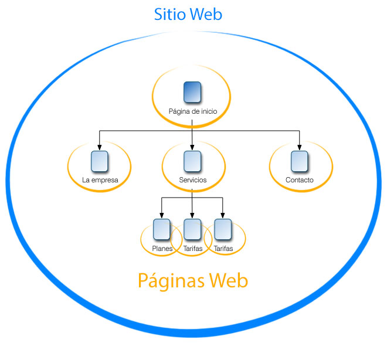

# TRÁFICO Y AUDIENCIA

## Introducción

El tráfico es lo principal en nuestra página web, por lo que, exceptuando ciertos casos, es uno de los objetivos principales a tener en cuenta de cualquier página web, aumentar el tráfico. Por ello es importante conocer si tenemos suficiente tráfico y de no tenerlo, porqué. Por lo tanto debemos definir que KPI's vamos a estudiar y dependiendo tomar acciones para mejorar el flujo de tráfico a nuestro sitio web.

Desde el punto de vista de las métricas analizaremos lo siguiente:

-  Las sesiones
-  Usuarios
-  Nº de visitas a páginas
-  Páginas por sesión
-  Duración media de la sesión
-  % de rebote
-  % de nuevas sesiones
-  Datos demográficos
-  Sistemas operativos
-  Operador desde le que nos visitan

Desde el punto de vista del tipo de tráfico segmentaremos por los siguientes puntos:

-  Orgánico
-  Pago
-  Display
-  Email
-  Directo
-  Referral
-  Social
-  Otros...

Antes de detallar cada uno de los puntos anteriores debemos definir cómo y qué ocurre en el proceso de captación de datos de un visitante.

## Objetivos

-  Conocer las diferencias entre sitio web y página web.
-  Conocer las característias de las Cookies y su función.
-  Conocer las magnitudes relevantes y los tipos de tráficos.

## Mapa Conceptual

## Aspectos Generales

### SITIO Y PÁGINA WEB

Antes que nada estableceremos la diferencia entre **Página y Sitio Web**.

Sitio Web es aquel que esta conformado por un dominio, tomando como ejemplo **www.facebook.com**, todo lo correspondiente a **www.facebook.com** es el sitio web, sus páginas, assets, corporación, etc...

Las **Páginas Web** son cada una de las secciones que conforman un dominio. Usando el ejemplo de **www.facebook.com**, un ejemplo de página ppdria ser **www.facebook.com/perfil-de-prueba**, siendo esta última, una página dentro del sitio **www.facebook.com**.

Es importante saber la diferencia, principalmente por las herramientas que se van a utilizar para poder medir los KPI's, ya que habrán ciertas herramientas que servirán para monitorizar parámetros del sitio web en conjunto o de una página en especifico dependiendo del análisis que estemos realizando y el objetivo marcado.

### COOKIES

Las cookies son datos en formato de texto que el navegador almacena en el ordenador del usuario de manera que permita en un futuro, mediante dicho texto, identificar al usuario y dependiendo del caso, la sesión u cualquier dato que el servidor sea capaz de interpretar y utilizar.

[Descripción medianamente técnica de cómo funciona una cookie]

## MAGNITUDES RELEVANTES

### Introducción

Hay cietos de métricas y tecnicismos relacionados con el mundo de la analítica, tantos que ni la persona más experta en el sector puede conocer en profundidad todas las que puedan existir.

En este curso veremos las métricas mas relevantes que suelen ser comunes en todas las herramientas de análisis disponibles en el mercado.

### Sesiones

Las sesiones son la métrica general más relevante ya que esta contabiliza el total de personas que han visitado nuestro sitio web. Por lo que esta métrica es por definición el **tráfico** que recive nuestro sitio web en un periodo de tiempo definido.

Por otro lado, relacionado pero sin tener un concepto diferente son las **visitas**, las visitas a diferencia de las sesiones son las visitas que reliza un idspositivo en nuestro sitio web a la hora de ir navegando dentro del mismo, por lo que una **sesión** puede tener 10-15-20 **visitas**.

Hay otros conceptos a tener en cuenta a la hora de analizar los datos de una página web como:

-  El termino visitas se refiere a las sesiones que realiza un usuario al momento de entrar a un sitio web y pasa un tiempo navegando dentro de este y se va.

-  Si un usuario permanece activo en nuestra web y permanece inactivo **durante 30 minutos** o más, y luego vuelve a navegar en nuestra web, cuenta como una visita más. Esto es debido a que **las cookies tienen una duración de 30 minutos**, por lo que al estar inactivo por esa cantidad de tiempo, la cookie expira y vuelve a generarse otra.

-  Del mismo modo, si un usuario abandona la web y vuelve antes de los 30 minutos, se considera que esta en la misma visita. Esto se debe tomar en cuenta porque un usuario puede estar navegando en nuestra web durante horas manteniendo una misma visita.

-  El usuario que visita nuestro sitio web y navega dentro de este, sigue contando como una misma sesión independientemente de la cantidad de páginas que haya visitado durante dicha sesión.

-  También podemos ver la cantidad de visitas que ha tenido una página web en concreto. Por lo que la visita al sitio web se cuenta diferente a la visita de una página en concreto. De esta manera podemos ver que productos cuentan con más visitas y cuales con menos para poder tomar acciones al respecto.

- Hay dos tipos de visitas principales, las **nuevas** y las de **retorno**. Las visitas nuevas son de las personas que es la primera vez que entran en el sitio, por lo que las de retorno son de aquellas que ya han visitado nuestro sitio web con anterioridad.

- Hemos visto que las cookies tienen caractertisticas temporales que debemos tener en cuenta pero no son las unicas, a continuación veremos otros aspectos que debemos tomar en cuenta respecto a las cookies:

    - Cuando un usuario accede a un sitio web desde 2 navegadores distintos, se cuenta como visitas diferentes. Esto se debe a que el navegador almacena la cookie en el navegador sin tener la posibilidad de compartir dichas cookies entre navegadores distintos.

    - Si el usuario borra o no acepta las cookies, no podra ser identificado como el mismo visitante unico en próximas visitas.

- El registro de las visitas en cualquier herramienta estadística se realiza de la siguinte manera:

    1. Cuando el usuario visita la primera página del sitio, empieza una nueva sesión para el navegador en el cual se encuentre navegando.
    2. Si el usuario en el mismo navegador, vivista distintas páginas dentro de la misma sesión, estas visitas se adjudican a la sesión que se encuentre abierta en ese momento.
    3. La sesión terminara cuando el usuario abandone el sitio o permanezca inactivo por más de 30 minutos.

### Visitantes

