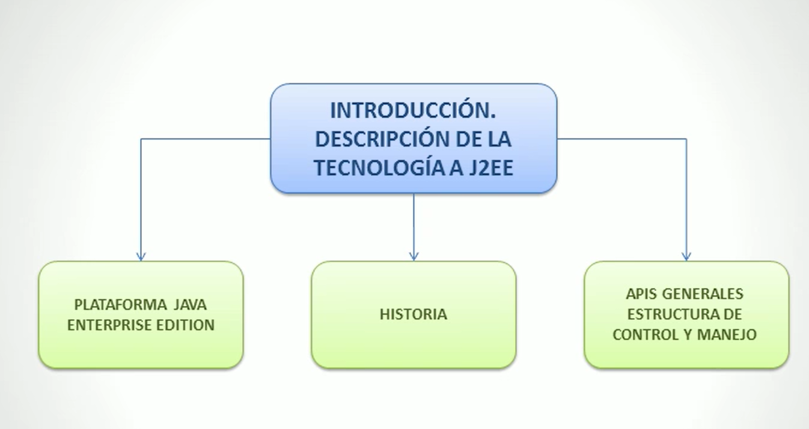

# PLATAFORMA DE DESARROLLO J2EE

## Objetivos

- Introducir los conceptos básicos de la técnología J2EE.
- Aprender sobre la historia de la tecnología J2EE.
- Conocer las aplicaciones y usos de esta técnología.

## Mapa conceptual

## Introducción

J2EE es la versión de empresas para el desarrollo de aplicaciones en el lenguaje de programación Java.

Permite el desarrollo de software modularizado siguiendo lo definifo en la especificación estándar de la Java Community Process.

Se debe seguir con el estándar para que la Java Community Process pueda validar mediante sus estandares el código escrito.

JEE cuenta con especificaciones en su API que algunas son JDBC, RMI, e-mail, JM's, Servicios Web, XML... y especifica como se coordinan entre sí. JEE también incluye especificaciones unicas como Enterprise JavaBeans, servelts, portlets, JavaServerPages y algunos protocolos web. ERsto permite al desarrollador crear soluciones escalables y portables entre plataformas para las empresas.

Alguna de las ventajas que ofrece esta herramienta son el manejo de transacciones del servidor de aplicaciones, gran seguridad, escalabilidad, concurrencia y administración de al infraestructura desplegada.

## API's generales estructura de control y manejo

- javax.ejb
    Enterprise JavaBeans (ejb) esta compuesto por una serie de API's que pueden ser soprotadas por un contenedor de aplicaciones que son compatibles con la persistencia, RPX, concurrencia, transacciones y control de acceso para los elementos distribuidos.

- javax.naming
    Los paquetes de javax.naming, javax.naming.directory, java.naming.event, javax.naming.Idap y javax.naming.spi definen la API de Java Naming and Directory Interface.

- java.sql
    Los paquetes de java.sql nos permiten interactuar con la BBDD.

- java.transactions
    Estos paquetes definen a la Java Transaction API

- javax.xml
    Estos paquetes definen la API JAXP.

- javax.jms
    Estos paquetes definen la APi JMS.

- javax.persistence
    Este paquete se aportan clases e interfaces par administrar la comunicación entre providers de persistencia, las clases que los gestionan y los clientes de JPA.

## Beneficios
Uno de los beneficios de trabajar con Java EE es que se puede empezar con muy poco o gratis dependiendo del caso. Además de contar con herramientas OpenSource que nos permiten desarrollar soluciones de manera sencilla.

